# Chapter notes
## Chapter 14: Authentication
**Summary**   
In this chapter, 

**Chapter 14 notes:** 
1. Sign-In UI        
     - added a Sign-In modal which has showModal and hideModal to control the visible state of the modal.      
2. Google Sign-In       
     - replaced the Sign-In button with a button to sign in using Google.     
3. Verifying the Google Token      
     - verify the google token at the back-end.     
4. JSON Web Tokens      
     - generated a token and send it to the browser by using JSON Web Tokens, it will be included in every API call to identify the signed-in user.     
     - used cookies to store JWT.     
5. Signing Out      
     - clear JWT cookie in the browser and forgot the Google authentication when click on sign out.      
6. Authorization     
     - ensured that the back-end APIs are secure and prevented unauthorized modification.        
7. Authorization-Aware UI      
     - disabled the create issue button in the navigation bar when the user is not signed in.     
8. React Context       
     - made all other relative components aware of the authentication status, disabled the close,delete and submit buttons.     
     - React Context can be used to pass properties across the component hierarchy without making intermediate components aware of it.          
9. CORS with Credentials       
     - made the application to work in the non-proxy mode by relaxing the CORS options and maintained security at the same time.      
10. Server Rendering with Credentials     
     - implemented server rendering with credentials to solve the flicker which transitions from an unsigned-in state to a signed-in state.     

## Chapter 13: Advanced Features
**Summary**   
In this chapter, I learned and used more advanced features that make the IssueTracker application more useable. Firstly, I used higher order component to reuse code. I also learned more operations about MongoDB like automatically add issues into database, get summarized information and so on. In addition, I added a pagination which is necessary for big datasets and implemented an undo delete function. Lastly, I added a search bar where users can search issue by inputing key words.    

Here is the screenshot of my program:   
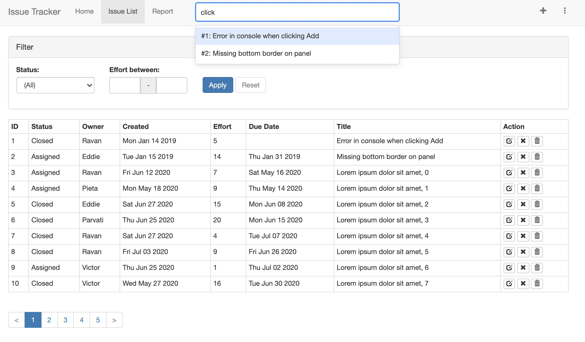
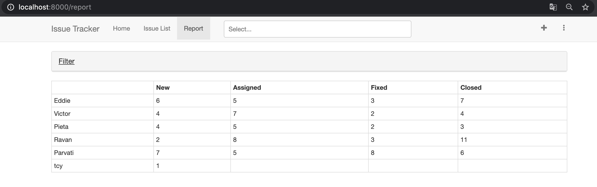

**Chapter 13 notes:** 
1. Higher Order Component for Toast     
     - created higher order component for toast and reused it for IssueList, IssueEdit and IssueAddNavItem components.      
2. MongoDB Aggregate     
     - randomly added 100 issues into database, and tested mongodb commands that will help build the Report page.     
3. Report page          
     - implemented issues counts API and used it for the report page.     
4. Pagination    
     - created an API to calculate issue's page and used the React-Bootstrap to add a pagination part according to the API.     
5. Undo Delete    
     - created an API to restore a deleted issue and created an undo button to recall the API.      
6. Search Bar     
     - created an API to find issues when users type some words, and added a search bar to input words.       

## Chapter 12: Server Rendering
**Summary**   
In this chapter, we implemented the server rendering which is the ability to generate HTML on the server and then send it to browser. Firstly, I created About page to implement the basic server rendering and also compared it with browser rendering. Also, I solved some issues like compatible issue, content mismatch issue and so on. After using server rendering correctly for about component, I extended the changes to all other pages, like IssueList component, IssueEdit component and IssueDetail component.      

Here is the screenshot of my program:   
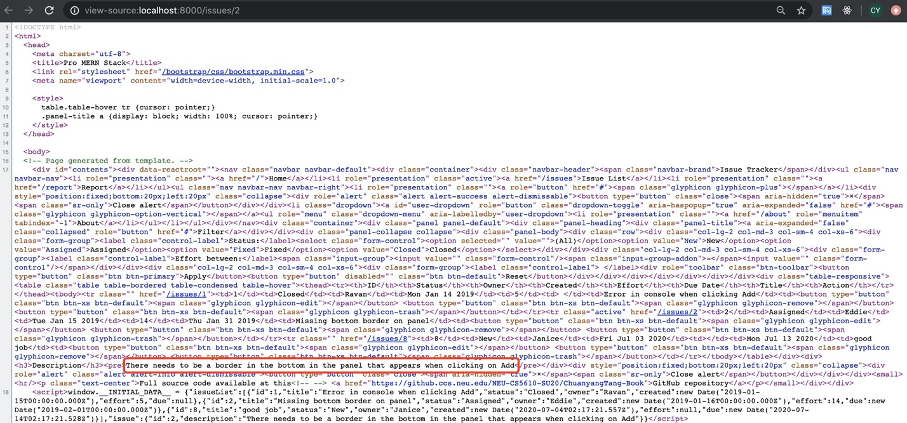

**Chapter 12 notes:** 
1. New Directory Structure      
     - split source code into three directories, moved browser-specific and server-specific files to new directories called browser and server respectively.      
2. Basic Server Rendering      
     - implemented the About page and compared browser-rendered version and server-rendered version.      
3. Webpack for the Server      
     - used webpack for the server and solved the compatible issues between webpack and server-side node packages.       
4. HMR for the Server      
     - used HMR to reload the modules automatically in the back-end, then we don't have to  restart for every change.     
5. Server Router       
     - solved the issue that About page was rendered from the server was different from the way it was rendered by navigating to it from /issues.       
6. Data from API      
     - tried to get data from API server for About component, and used a global store for all data that is needed for the hierarchy of components that need to be rendered.     
7. Syncing Initial Data      
     - solved the error that the tree generated by hydrate() call doesn't match the tree that is already there, rendered by the server.     
     - the solution is to pass the same initial data resulting from the API call to the browser in the form of a script and use that to initialize the global store.      
8. Common Data Fetcher      
     - added a data fetcher in About component that could be used to populate its message to take care of the case where it is mounted only on the browser.      
9. Generated Routes      
     - fixed the React error for mismatched div for all pages.       
     - kept a list of routable pages in routes.js which is a simple array with the path to the route and the component that needs to be rendered if the route is matched with the URL.       
10. Data Fetcher with Parameters     
     - made the IssueEdit component rendered from the server with the data that it requires prepopulated.      
     - serialized the contents of the initialize data to solve the `Uncaught TypeError: created.toDataString is not a function` problem.       
11. Data Fetcher with Search     
     - implemented the data fetcher in the IssueList component and dealt with the fact that the search string part of the URL is needed for fetching.      
12. Nested Componenets        
     - changed the IssueDetail to server rendering by including an optional Issue ID in the route specification for IssueList.     
13. Redirects     
     - changed the request to home page / from redirecting to /issues in the browser history to a 301 redirect that browser fetches /issues instead of the server.      

## Chapter 11: React-Bootstrap
**Summary**   
In this chapter, I used the React Bootstrap to make the IssueTracker website looks better and be responsive. Firstly, I used bootstrap components to change replace original components such as buttons, navigation bar, tables etc. Also I changed the filter into a clickable component and it can be displayed or hidden when users click it. In addition, I changed the issue add button to a modal component which is a better way than separate page when the required field is small.       

Here is the screenshot of my program:   
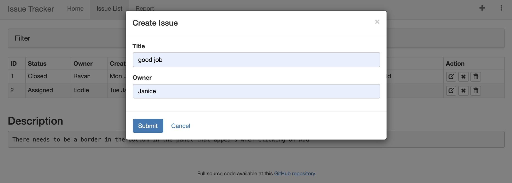

**Chapter 11 notes:**   
1. Bootstrap Installation     
     - Installed React-Bootstrap which contains a library of React components and has no CSS styles or themes itself.     
     - made the IssueTrack page fit different size of screen.     
2. Buttons      
     - changed Apply and Reset buttons to Bootstrap buttons and used icons to replace Close and Delete links.     
3. Navigation Bar     
     - styled the navigation links in the header and added a footer in the bottom that are visible on all pages.    
4. Panels    
     - BootStrap's Panel component is a great way to show sections separately using a border and an optional heading.    
     - used Grid component to add margins and made the panel clickable.    
5. Tables      
     - replaced plain table into a Bootstrap table which looks better and made the row clickable to select the issue, it doesn't conflict with edit, close and delete functions.      
6. Forms     
     - changed the style of the filter by using many React-Bootstrap components such as ButtonToolbar, ControlLabel.      
7. The Grid System     
     - used Bootstrap's grid system to make the table look better in different size of screen.     
8. Horizontal Forms     
     - changed the Issue Edit page to use a horizontal form and also used validation states that Bootstrap provides to highlight invalid input.     
9. Validation Alerts     
     - used Alert component to display the validation message in the Issue Edit page.      
10. Toasts     
     - Created a component Toast to make result messages and informational alerts disappear after a few seconds automatically.     
11. Modals      
     - replaced the issueadd component with a modal dialog that is launched by clicking the create issue navigation item in the header.       
     - a modal works better than separate page when the number of required fields is small.      

## Chapter 10: React Forms
**Summary**   
In this chapter, Firstly, I compared the controlled and uncontrolled form components, and added apply button and reset button to control filters. Secondly, I created some React UI components such as NumInput, DateInput and TextInput, which used for different types of data. Lastly, I finished the CRUD paradigm by adding Update and Delete operation. I implemented update for a whole issue and also just change to states of issue. For the deletion part, I added a delete button and users can click it to delete the issue.     

Here is the screenshot of my program:   
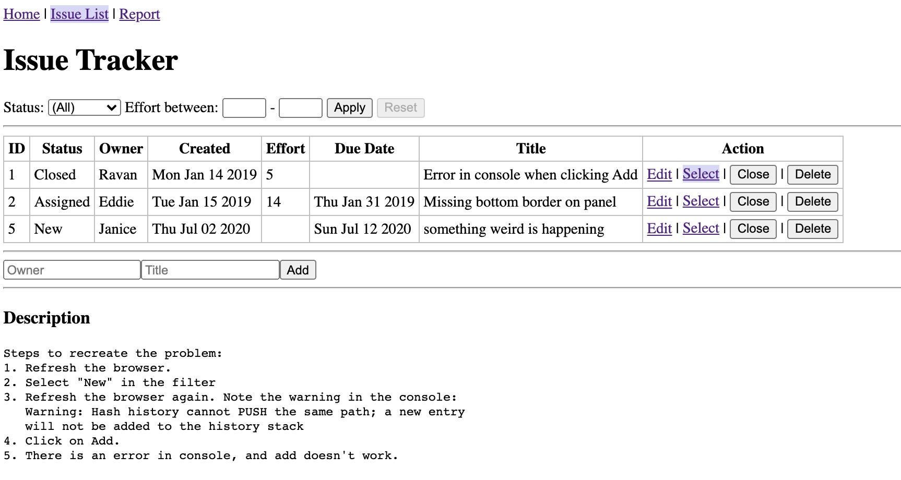
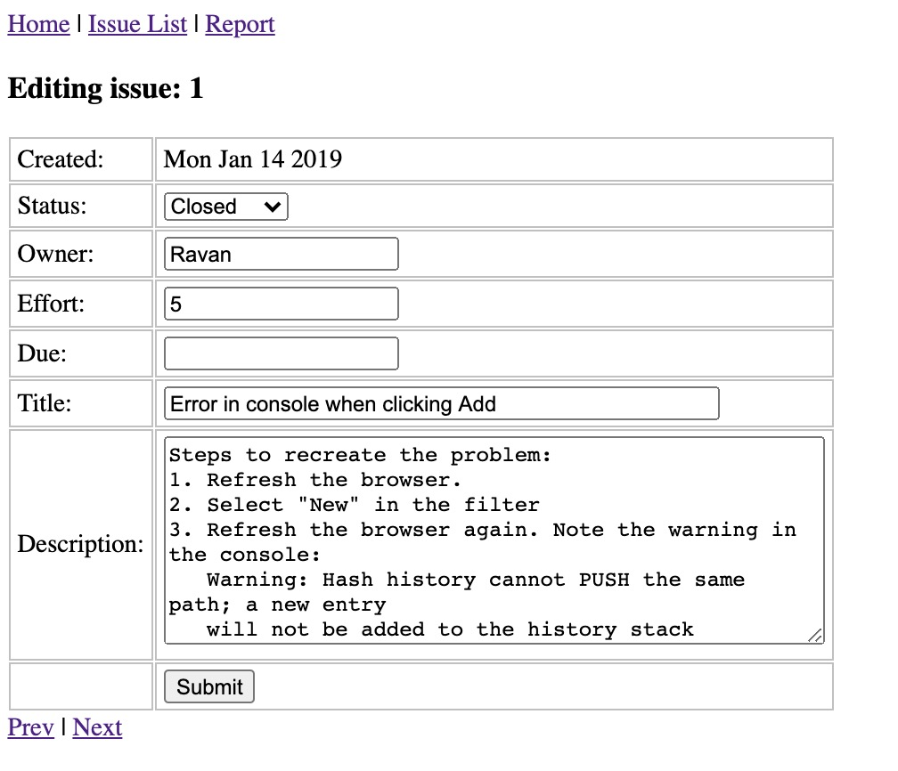

**Chapter 10 notes:**   
1. Controlled Components in Forms        
     - controlled components: the input form element whose value is controlled by React.      
     - added "Apply" button and "Reset" button to control filters
2. Typed Input     
     - added a filter based on "Effort", the value is an integer. So I added two input fields to specify the maximum and minimum Effort values.      
3. Edit Form     
     - implemented the edit page for issues, also added Prev and Next links in this page.      
4. Specialized Input Components     
     - make reusable UI components for the non-string inputs, which emit natural data types in their `onChange` handlers.     
     - Number Input     
       - created UI component NumInput in `NumInput.jsx` file and used it for the effort field in the Edit page.     
     - Date Input     
       - Created UI component DateInput in `DateInput.jsx` file and also check if users input valid date format.      
     - Text Input     
       - Created UI component TextInput in `TextInput.jsx` file and also convert empty strings to null value.     
5. Update   
     - Update API      
       - implemented an API called `IssueUpdateInputs` that updates an issue.    
     - Update an Issue     
       - use the update API to save the changes made by users.     
     - Update a Field     
       - use the update API and added a button to change the Status of issues to Closed     
6. Delete      
     - Delete API     
       - implemented the Delete API and used a new collection to store all deleted issues.      
     - Delete an Issue      
       - added a delete button to delete an issue, which use the delete API.     

## Chapter 9: React Router
**Summary**    
In this chapter, I implemented router by using React Router component in the Issuetracker application. Firstly, I added a navigator bar on the top of the page which helps us to test the simple routing, and also connected the URLs in the browser. Secondly, I used parameters and query strings to specify different contents. Then I used React Link component to replace the hrefs hyperlinks to make it more convenient to create links. Lastly, I added a description part by using the Nested Routes and also changed hash-based routing to browser history-based routing.      

Here is the screenshot of my program:   
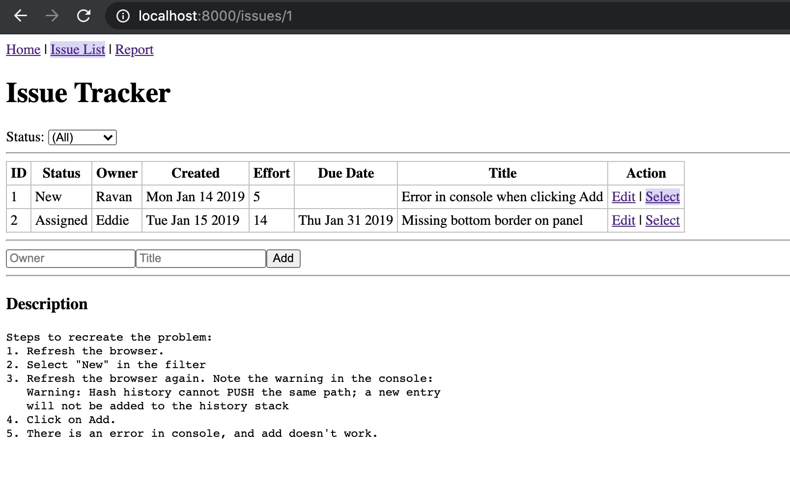

**Chapter 9 notes:**    
1. Simple Routing     
     - React Router provides `Router` to achieve routing between different components.     

2. Route Parameters     
     - Using the : character followed by the name of the property to specify parameters in the route path.      

3. Links     
     - React Router provides a better way than using hrefs to create links via the `Link` component.     
     - The paths in a Link are always absolute, it doesn't support relative paths.     
     - The `NavLink` allows us to highlight the currently active navigation link.     

4. Nested Routes        
     - nested routes: the beginning part of the path depicts one section of a page, and based on interaction with that page, the latter part of the path depicts what's shown additionally in the page.     
     - used `NavLink` to highlight the selected issue.    

## Chapter 8: Modularization and Webpack
**Summary**    
In this chapter, I continued to restructuring the program and modularized the code. Firstly, I split the back-end modules into different files for different components and used `require` to import other components. Secondly, I used Webpack for code transforming and bundling and removed the dependency on the CDN. In addition, I used Hot Module Replacement to change modules in the browser when application is running and also learned the source maps which contains original code that can help in debugging.          

Here is the screenshot of my program:   
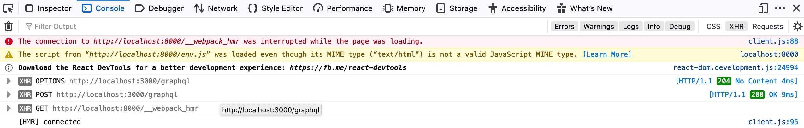

**Chapter 8 notes:**    
1. Back-End Modules      
     - `require()` imports symbols from another module, it returns all variables which are `module.exports` in the other module.    

2. Front-End Modules and Webpack      
     - To import another file, use `import "element or variable" from 'identifier of the file or module'`     

3. Transform and Bundle     
     - each React component be placed in its own file, especially if the component is a stateful one, stateless components can be combined with other components when convenient and when they belong together.      

4. Hot Module Replacement     
     - The Hot Module Replacement changes modules in the browser while the application is running, removing the need from a refresh altogether. Also it will retain the application state. Most importantly, it saves time by updating only what is changed.     

5. Debugging     
     - it's hard to put breakpoints in the debugger because the original source code gets lost. So we should use Webpack which provide the source maps containing original code.    

## Chapter 7: Architecture and ESLint
**Summary**    
In this chapter, firstly, I separated this program into two servers, UI server and the API server. They are ran on the same computer but on different ports. Then deleted all hard-coded things and used the `dotenv` package which made program store all configuration in a .env file. In this way, it's better to fit for different deployment environments. Lastly, I sanitized the code according to specific standard, which make the code more readable and it's good for group development.     

Here is the screenshot of my program:   
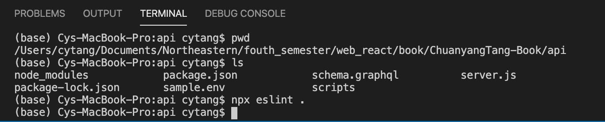
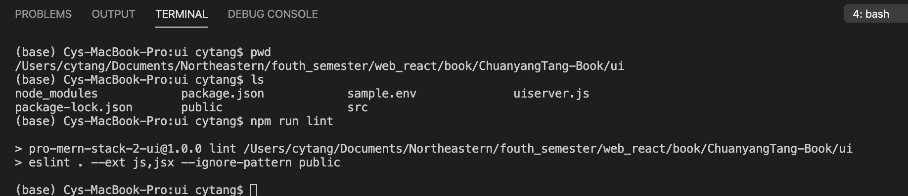

**Chapter 6 notes:**   
1. UI Server      
     - The UI server contains only the static middleware, it will be responsible for generating HTML pages by calling the API server's APIs to fetch the necessary data.     
     - The API server will be responsible for handling only the API requests, it will respond only to URLs matching /graphql in the path.     

2. Multiple Environments    
     - In this part, all hard-coded things were changed and keep them as variables that can be changed easily, like urls, ports.       
     - The package `dotenv` is used to convert variables stored in a file into environment variables. And it looks for a file called .env.       

3. Proxy-Based Architecture         
     - The Same-origin policy is to prevent malicious websites from gaining unauthorized access to the application. The gist of it is that since cookies set by one origin are automatically attached with any request to that origin, it is possible that a malicious website can make a call to the origin from the browser and the browser will attach the cookie.       

4. ESLint     
     - A linter checks for suspicious code that could be bugs and also check whether your code adheres to conventions and standards that you want to follow across your team to make the code readable.      
     - ESLint is a very flexible linter that lets you define the rules that you want to follow.        

5. ESLint for the Front-End     
     - Two ways to ignore patterns of files: (1) `npx eslint . --ignore-pattern public` (2) add them to a text file called .eslintignore.     

## Chapter 6: MongoDB
**Summary**    
In this chapter, firstly, I learned basic conceptions about MongoDB like the difference between MongoDB and traditional relational databases, installed it locally and tried to use the mongo shell and Node.js driver to do some basic operations including read, find update and delete in MongoDB. Secondly, I modified the Issue Tracker application to do read and write operation in the MongoDB which make the program persistently store the issue information.      

Here is the screenshot of my program:   
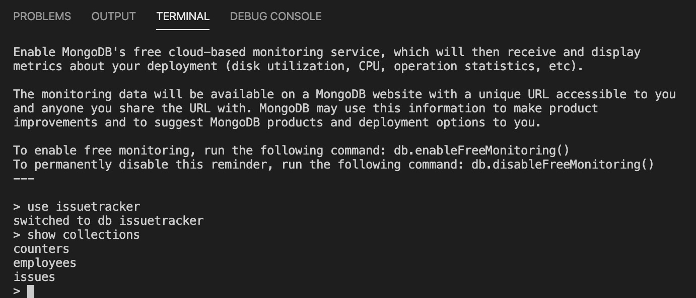   

**Chapter 6 notes:**  
1. MongoDB Basics    
     - Documents    
       - Document databases can contain arrays and other objects in a nested manner and the contained objects don't have to be separated out into other documents.    
     - Collections   
       - A primary key is mandated in MongoDB, it has the reserved field name _id which is  a special type called ObjectId.    
     - Query Language    
       - MongoDB query language is made up of methods to achieve various operations, the main methods for read and write operations are the CRUD methods, other methods include aggregation, text search and geospatial queries.   
     - The Mongo Shell    
       - print() can print only strings, and printjson() can print objects as JSON.    

2. MongoDB CRUD Operations   
     - Create   
       - `db.employees.insertOne()`    
       - `db.employees.insertMany()`        
     - Read     
       - find method has two argument, filter and projection.    
       - `db.employees.findOne({ id:1})`    
       - `db.employees.find({ age:{$gte(lte) :30}})`    
       - with index, any query that uses a filter that has the field age in it will be significantly faster because MongoDB will use this index instead of scanning through all documents in the collection.    
       - `db.employees.createIndex({ id: 1 }, { unique: true })` create a unique index on id.     
     - Projection    
       - the project is the second argument of find method, it specifies which fields to include or exclude in the result to decrease the network bandwidth.     
       - the format is an object with one or more field names as the key and the value as 0 or 1, to indicate exclusion or inclusion.     
     - Update     
       - it has two arguments, one is a query filter, the second is an update specification if only some fields of the object need to be changed.    
       - `db.employees.updateOne()`     
       - `db.employees.updateMany()`     
       - `db.employees.replaceOne()`, all pervious info will be replaced by new info     
     - Delete    
       - `db.employees.deleteOne()`    
       - `db.employees.deleteMany()`    
     - Aggregate    
       - To group the aggregate by a field. We'll need to specify the name of the field(prefixed by a $) as the value of _id.        

3. Schema Initialization      
     - MongoDB doesn't enforce a schema, there is no schema initialization as in relational databases, the only thing that is really useful is the creation of indexes.    

4. Reading from MongoDB      
     - Since the issues from the database contain an _id in addition to the id field, don't forget include that in the GraphQL schema of the type Issue. Otherwise, clients who call the API will not able to access this field.      

5. Writing to MongoDB     
     - update a counter and return the updated value by using `findOneAndUpdate()`, and we use the $inc operator to increment the current value.     

## Chapter 5: Express and GraphQL
**Summary** 
In this chapter, firstly, I learned the Express framework like routing, handler function and so on. Then I learned REST API which is very popular pattern but it is hard to use when different clients access the same set of APIs. So we used the GraphQL(an query language used to describe requests from a web client to a web server). I also used the tool Playground that developers can explore the API and learned how to change the date to a simpler format. Lastly I implemented input validation and display errors.       

Here is the screenshot of my program:   
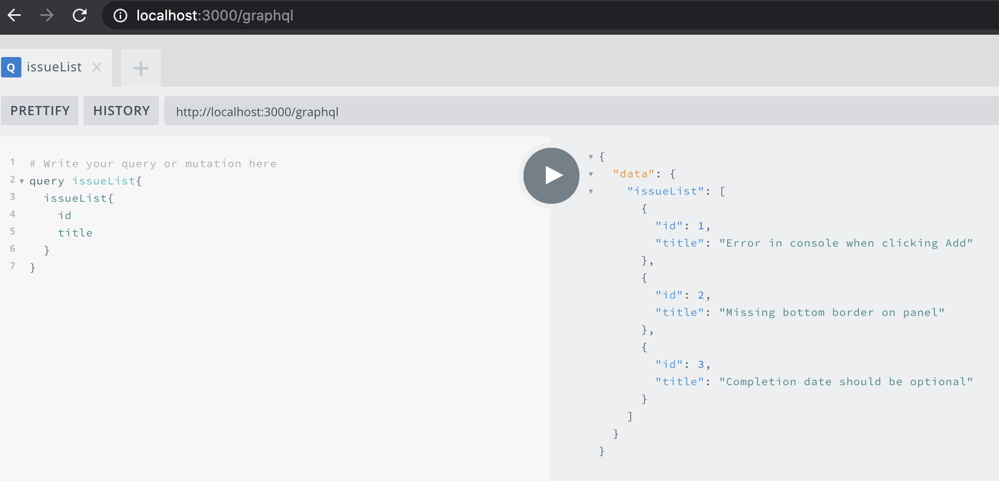   

**Chapter 5 notes:**  
1. Express      
     - Routing   
       - A route specification consists of an HTTP method(GET, POST, etc.), a path specification that matches the request URI, and the route handler. Example:   
       
app.get('/hello',(req, res)=>{   
                         res.send('Hello World!');    
                    });    
       
      
     - Handler Function      
       - once a route is matched, the handler function is called
     - Middleware    
       - Middleware functions are those that have access to the request object(req), the response object, and the next middleware function in the application's request-response cycle.    
2. GraphQL    
     - Field Specification    
       - the properties of an object that need to be returned must be specified. It's invalid to request nothing   
     - Graph Based    
     - Strongly Typed     
3. The About API   
     - npm packages for graphql-tools, apollo-server, and the base package graphql `npm install graphql@0 apollo-server-express@2`    
     - has two special types that are entry points into the type system, called Query and Mutation. The subtle difference is query fields are executed in parallel, mutation fields are executed in series.    
     - default values are optional, values defined by ! after the type are mandatory    
     - initialize the GraphQL, construct an ApolloServer object defined in the apollo-server-express package.    
4. List API Integration   
     - add whatwg-fetch Polyfill   
     - construct a GraphQL query in loadData() method   
     - use `response.json()` to get the JSON data converted to a Javascript  
     - `setState()` to supply the list of issues to the state variable   
5. Custom Scalar Types   
     - define a type for the scalar using the `scalar` keyword instead of `type`    
     - add a top-level resolver for all scalar types    
6. The Create API   
     - have to use the `input` keyword instead of `type`, and define a new type(IssueInputs) as an object that has the fields we need for the input        
     - use the type IssueInputs as the argument type to the new issueAdd field under Mutation     
     - implement the parsers for receiving data values, there are two methods that need to be implemented in the GraphQLDate resolver: `parseValue` and `parseLiteral`    
7. Query Variables    
     - name the operations to use variables   
     - the input value has to be replaced with a variable name, variable names start with the $ character    
8. Input Validations   
     - detect input errors by checking if the constructed date object is a valid value, `isNaN(date)`   
    
**Chapter 5 errors:** 
1. The function should be `function issueValidate(issue)` instead of `function validateIssue(_, { issue })` in page 123 and 125    

## Chapter 4: React State
**Summary**  
In this chapter, I implemented a `Add` function by using State, which adds new issues according to user's inputs. Firstly, I set a timer to do state initialization. Then create a method to add a new issue to update state. In React, only parents can pass information down to children, so I had to lift the state up in my program. Finally I created the text inputs and add button to trigger the add event and also changed stateless components to simple functions.     

Here is the screenshot of my program:   
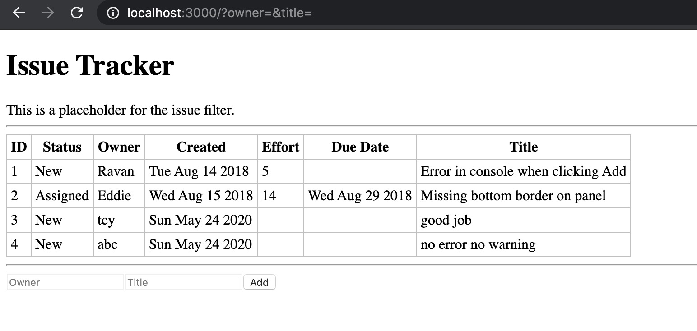   

**Chapter 4 notes and errors:**  
1. Initial State   
     - `this.state` is a key-value pair in component's class, the key is a state variable name and the value is the current value of that variable.   
     - add constructor and set initialIssues as the initial state, and also you can have other state variables like `page:0`    
2. Async State Initialization
     - state can be modified only by calling `this.setState({issues: newIssues});`    
     - React provides many lifecycle methods to cater to situations where something needs to be done depending on the stage, or changes in the status of the component.    
          - componentDidMount(): is called as soon as the component's representation has been converted and inserted into the DOM.   
          - componentDidUpdate(): is invoked right after an update occurs, not for initial render.    
          - componentWillUnmount(): is useful for cleanup such as cancelling timers and pending network requests.    
          - shouldComponentUpdate(): optimize and prevent a rerender in case there is a change in the props or state that really doesn't affect the output or the view(rarely used).    
3. Updating State     
     - you can't push issue into issues directly, because the variable this.state in the component should always be treated as immutable, you have to make a copy of an array: `issues = this.state.issues.slice();`    
4. Lifting State Up    
     - In React, only parents can pass information down to children, so if we have to pass info among siblings, we have to lift the state and all the methods up to common parent    
     - bind the method createIssue in the constructor of IssueList to avoid the confusing meaning of "this" `this.createIssue = this.createIssue.bind(this);`    
5. Event Handling   
     - In order to prevent the form from being submitted when the Add button is clicked, we need to call the `preventDefault()` function on the event. The new issue can't add into the form if I delete this clause.    
     - In order to persist the changes, we could either save the issues in local storage on the browser or save it in the server.   
6. Stateless Components    
     - For performance reasons and clarity of code, change stateless components to pure functions    
7. Designing Components   
     - State vs. Props    
           - both hold model information, but props are immutable, state is not    
           - State belongs to the component, props belongs to an ancestor, the component gets a read-only copy     
     - Communication    
           - Parents communicate to children via props, when state changes, the props automatically change,Children communicate to parents via callbacks     
           - Siblings and cousins can't communicate with each other, the info has to go up the hierarchy and then back down    

## Chapter 3: React Components
**Summary**  
In this chapter, I implemented a main page of the Issue Tracker, which shows basic information of issues like ID, Status, Owner and so on. Firstly, I learned to use React classes which can be reused within other components and handle events. Then by using composing components, the UI split into smaller independent pieces so that each piece can be coded and reasoned in isolation. Lastly I passed data among these components by using properties and children and showed these data on the Issue Tracker page.     

The Heroku link:   
https://pro-mern-stack-2.herokuapp.com/     

Here is the screenshot of my program:   
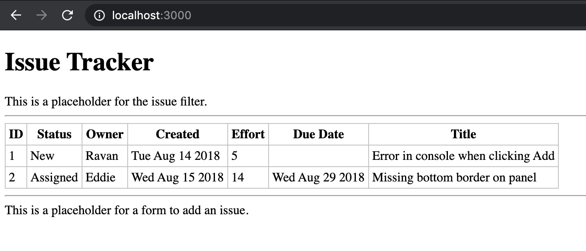   
  
**Chapter 3 notes and errors:**  
1. React Classes   
     - React classes are created by extending React.Component which all custom classes must be derived.   
     - `npm run watch` and `npm start` to run the program
2. Composing Components   
     - By using component composition, the UI can be split into smaller independent pieces so that each piece can be coded and reasoned in isolation.   
3. Passing Data Using Properties   
     - The easiest way to pass data to child components is using an attribute when instantiating a component. For example `<IssueRow issue_title="Title of the first issue" />`, then within the render() method of the child, we can display it by using `<td>{this.props.issue_title}</td>`    
4. Passing Data Using Children   
     - In the child component, use a special field of `this.props.children`   

## Chapter 2: Hello World
**Summary**  
In this chapter, I learned the basics of how React applications can be built. I wrote some simple code in React JSX and then used Babel to transform JSX into pure JavaScript to support old browsers.   
 
The Heroku link:   
https://pro-mern-stack-2.herokuapp.com/

Here is the screenshot of my program:   
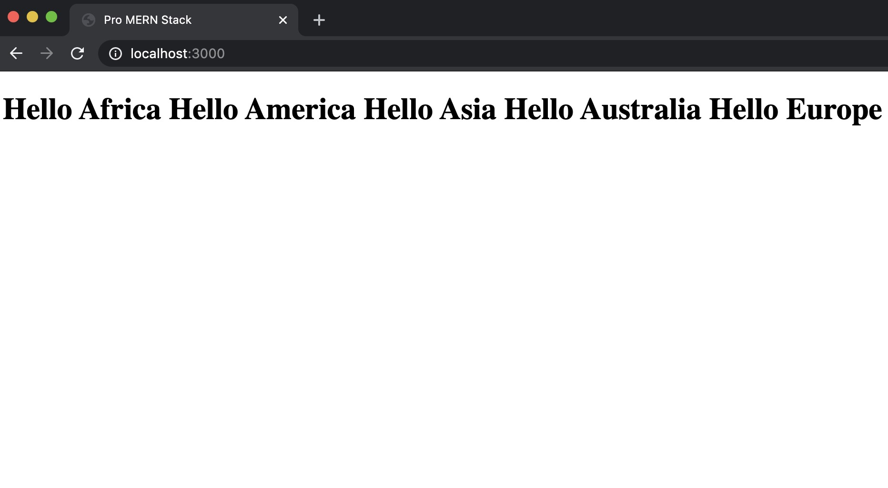

**Chapter 2 notes and errors:**   
1. Server-Less Hello World   
     - createElement(type, [props], [...children]): create the React element, return a React element which is a JavaScript object that represents what is shown on screen.   
     - render the Hello World React element:
	`ReactDOM.render(element, document.getElementById('content'));`   
2. JSX   
     - JSX: can be used to construct an element or an element hierarchy and make it look very much like HTML.   
     - Babel: browsers' Javascript engines don't understand JSX. Babel can transform JSX into regular JS.       
3. Project Setup   
     - nvm: Node Version Manager, makes installation and switching between multiple versions of Node.js easy.   
     - Express: the best way to run an HTTP server in the Node.js environment.An Express application is web server that listens on a specific IP address and port.   
     - Add entry point in package.json file      
4. Older Browsers Support   
     - All function implementations to supplement the missing implementation in older browsers are called polyfills. Babel provides these polyfills, which can just be included in the HTML file to make these functions available.     
5. Automate   
     - We can add scripts for start, transforms and other functions   
     - command "nodemon" restarts Node.js with the command specified whenever there is a change in a set of files   